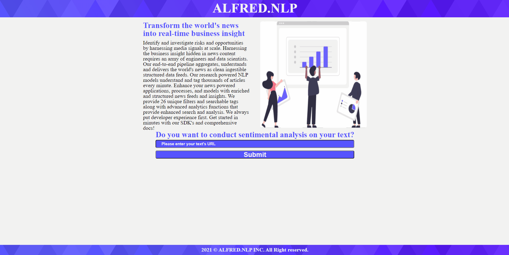

# Alfred NLP Analyzer :computer: :bar_chart: :scroll:


</br>
The herein repository host the necessary assets for a NLP web tool called "Alfred NLP Analyzer". It consists of an application enabling users to conduct sentimental analysis on text found in a given URL. The data analysis process is conducted by Meaningcloud's NLP data pipeline accessed via its api.

## Table of Content

1. [Design](#Design)
2. [Instructions](#Instructions)
   1. [Download repository files](#Download-repository-files)
   2. [Setup environment](#Setup-environment)
   3. [Add modules to setup server](#Add-module-to-setup-server)
   4. [Conduct npm audit](#Conduct-npm-audit)
   5. [Add 'dotenv' module](#Add-'dotenv'-module)
   6. [Add the following 'start' script in 'package.json'](#Add-the-following-'start'-script-in-'package.json')
   7. [Add testing via 'Jest' for unit-testing](#Add-testing-via-'Jest'-for-unit-testing)
   8. [Install 'node-fetch'](#Install-'node-fetch')
   9. [Install 'cors'](#Add-the-OpenWeatherMap-Api-key)
   10. [Add the static module bundler, namely 'Webpack'](#Add-the-static-module-bundler,-namely-'Webpack')
   11. [Add a build npm script](#Add-a-build-npm-script)
   12. [Install 'webpack-dev-server'](#Install-'webpack-dev-server')
   13. [Install 'Babel'](#Install-'Babel')
   14. [Install 'HtmlWebPackPlugin'](#Install-'HtmlWebPackPlugin')
   15. [Install 'CleanWebpackPlugin'](#Install-'CleanWebpackPlugin')
   16. [Install 'style-loader'](#Install-'style-loader')
   17. [Install 'file-loader'](#Install-'file-loader')
   18. [Install mini-css-extract-plugin](#Install-'mini-css-extract-plugin')
   19. [Install 'terser-webpack-plugin'](#Install-'terser-webpack-plugin')
   20. [Install Optimize CSS Assets Webpack Plugin](#Install-Optimize-CSS-Assets-Webpack-Plugin)
   21. [To reset user defaults](#To-reset-user-defaults)
   22. [Add 'serviceWorker'](#Add-'serviceWorker')
   23. [List of all needed npm commands](#List-of-all-needed-npm-commands)
3. [Examples](#Examples)
   1. [Example of hovering page](#Example-of-hovering-page)
   2. [Example of input data and seeing UI update](#Example-of-input-data-and-seeing-UI-update)
   3. [Example of error-handling](#Example-of-error-handling)
4. [Tools](#Tools)
5. [License](#License)

## Design

The “Alfred NLP Analyzer” prompts users to enter the URL containing their article meant to be analyzed. Using the meaningcloud’s API, the application uses it to conduct natural language processing on texts. More precisely, it parses the texts and uses sentimental analysis methods. The technologies used for this asynchronous application include HTML, SASS, and Vanilla JavaScript on its front-end. The back-end uses Node.js as well as Express.js. Jest is used for the unit-testing, and the static module bundler used is Webpack. Matt Visiwig produced the header’s and footer’s background from SVG Backgrounds.

## Instructions

### Download repository files

To have access to the assets necessary for the project, you may download the 'zip file' directly from the herein repository. Otherwise, you can clone the repository by using Git (<https://github.com/aimogue/NLP-Article-Analyzer-Web-Tool.git>), SSH (git@github.com:aimogue/NLP-Article-Analyzer-Web-Tool.git) Github CLI (gh repo clone aimogue/NLP-Article-Analyzer-Web-Tool) or Github Desktop. For more information on to clone a repository, please use the following link: <https://docs.github.com/en/free-pro-team@latest/github/using-git/which-remote-url-should-i-use>.

### Setup environment

Once the assets are within a folder, the environment needs to be setup. To do-so, it would be worthwhile using Git commands. It is pre-installed on Mac OS and Linux Distros, but not on Windows. For more information on how to setup Git on PC, please use the following link: <https://www.computerhope.com/issues/ch001927.htm>. To use the herein project, it will be necessary to have both Node.js and npm. To download them, please use the following link: <https://www.npmjs.com/get-np>.
</br></br>

To check if Node.js is installed, run the following command in the terminal:

```bash
node -v
```

To confirm that npm is installed, run this command in the terminal:

```bash
npm -v
```

To initialize the project, use the following command:

```bash
npm init
```

### Add modules to setup server

Use the following line, to add Node.js, and Express.js.

```bash
npm i node express
```

### Conduct npm audit

Use the following line, to check for dependency vulnerabilities and potentially fix them.

```bash
npm audit fix
```

### Add 'dotenv' module

Use the following command line to add the 'dotenv' module.

```bash
npm install dotenv
```

### Add the following 'start' script in 'package.json'

Replace the following command:

```json
"scripts": {
    "start": "node src/server/index.js",
},
```

### Add testing via 'Jest' for unit-testing

Use the following line, to install the 'jest' library as a development dependency. As unit testing, is not conducted in production mode.

```bash
npm install --save-dev jest
```

### Install 'node-fetch'

Use the following command to add a light-weight module that brings window.fetch to Node.js.

```bash
npm install node-fetch
```

### Install 'cors'

Use the following line, to add cors.

```bash
npm i cors morgan
```

### Add the static module bundler, namely 'Webpack'

Install Webpack using the following command.

```bash
npm i webpack webpack-cli
```

### Add a build npm script

In package.json, add a build npm script as:

```json
"scripts": {
    "test": "jest",
    "start": "node src/server/index.js",
    "build-prod": "webpack --config config/webpack.prod.js",
    "build-dev": "webpack serve --config config/webpack.dev.js --open --hot --port 8000"
  },
```

### Install 'webpack-dev-server'

To use webpack with a development server that provides live reloading. This should be used for development only.

```bash
npm install webpack-dev-server --save-dev
```

### Install 'Babel'

Babel is a toolchain that is mainly used to convert ECMAScript 2015+ code into a backwards compatible version of JavaScript. The following tool must be installed at the same level as your webpack js files. Use 'pwd' on the your CLI to confirm it. To install Babel, use the following command.

```bash
npm i -D @babel/core @babel/preset-env babel-loader
```

### Install 'HtmlWebPackPlugin'

Use the following command, to install the 'HtmlWebPackPlugin'.

```bash
npm i -D html-webpack-plugin
```

### Install 'CleanWebpackPlugin'

Use the following command, to install the 'CleanWebpackPlugin'.

```bash
npm i -D clean-webpack-plugin
```

### Install 'style-loader'

To convert the sass files to css files for the browser to process, use the following command line.

```bash
npm i -D style-loader node-sass css-loader sass-loader
```

### Install 'file-loader'

The file-loader resolves import/require() on a file into a url and emits the file into the output directory.

```bash
npm install file-loader --save-dev
```

### Install 'mini-css-extract-plugin'

To install this plugin, use the following command:

```bash
npm i mini-css-extract-plugin
```

### Install 'terser-webpack-plugin'

To install this plugin that uses terser to minify the JS files, use the following command:

```bash
npm install terser-webpack-plugin --save-dev
```

### Install Optimize CSS Assets Webpack Plugin

To install this plugin, use the following command:

```bash
npm install --save-dev optimize-css-assets-webpack-plugin
```

### Install 'meaning-cloud'

To install this plugin, use the following command:

```bash
npm install meaning-cloud --save
```

### To reset user defaults

To reset the configs, use the second command to make global resets.

```bash
echo "" > $(npm config get userconfig)
npm config edit
echo "" > $(npm config get globalconfig)
npm config --global edit
```

### Add 'serviceWorker'

Add 'workbox-webpack-plugin via the following command:

```bash
npm install workbox-webpack-plugin --save-dev
```

### List of all needed npm commands

All commands needed are found below:

```bash
npm init
npm i node express
npm install dotenv
npm i cors
npm install --save-dev jest
npm install node-fetch
npm i webpack webpack-cli
npm install webpack-dev-server --save-dev
npm i -D @babel/core @babel/preset-env babel-loader
npm i -D html-webpack-plugin
npm i -D clean-webpack-plugin
npm i -D style-loader node-sass css-loader sass-loader
npm install file-loader --save-dev
npm i mini-css-extract-plugin
npm install terser-webpack-plugin --save-dev
npm install --save-dev optimize-css-assets-webpack-plugin
npm install meaning-cloud --save
npm install workbox-webpack-plugin --save-dev
```

## Examples

### Example of hovering page



### Example of input data and seeing UI update


### Example of error-handling


## Tools

This webpage uses the following technologies for the front-end: HTML, SASS, and JavaScript (Vanilla). It also uses JavaScript on the server-side with Node.js and Express.js. The static module bundle used is Webpack.

## License

This codebase is a public domain, so feel free to use this repo for what you want.
